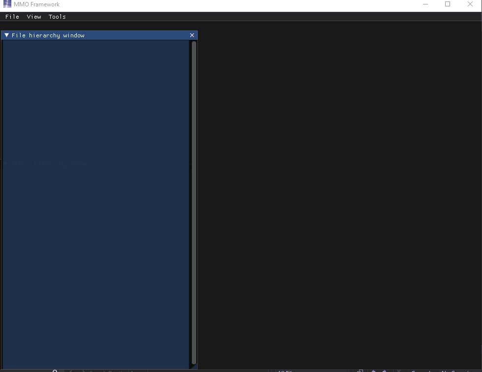
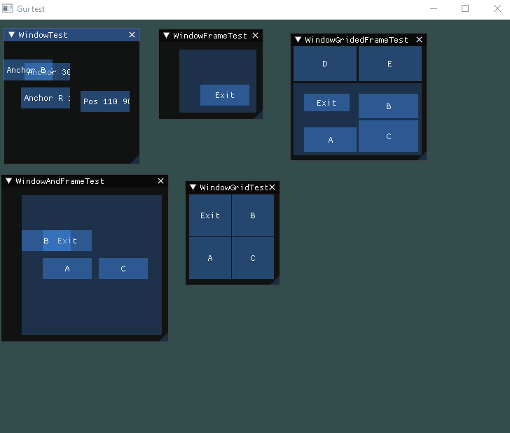
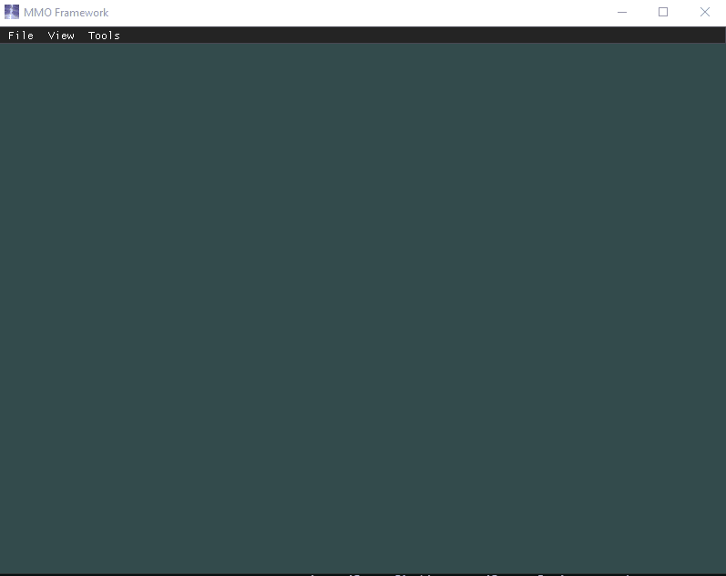
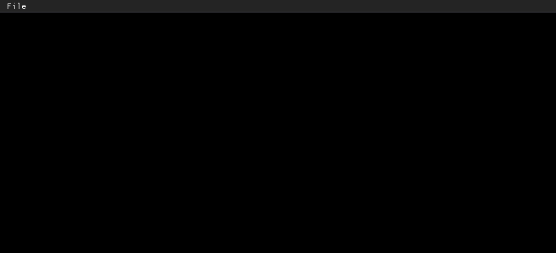
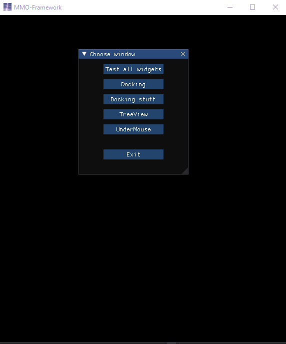
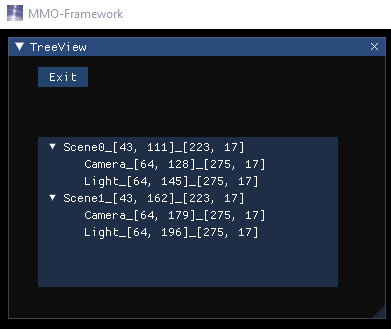
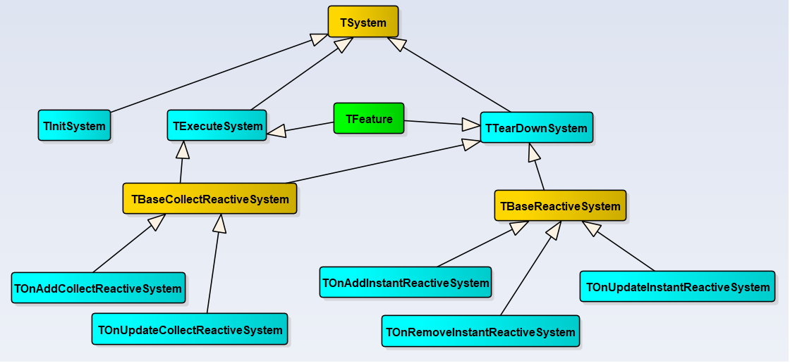

# MMO-Framework

[Boosty.donate](https://boosty.to/mmoframework)
 

 
 

To launch Editor use [Hub](https://github.com/RamilGauss/TornadoHub/releases).

## Disclaimer

### Idea  

`You have to think in another dimension`. In OOP, you have to think about how an object owns other objects.  
You have to think about the hierarchy of ownership and class inheritance. How to pass data from one object to other objects.  
In ECS, on the other hand, data is separate from logic. Logic has access to data anywhere and anytime. Everything is global. No need to think about hierarchy.   
All data is separated into pieces that are independent of each other. All logic is isolated. Behavior can be configured more flexibly.  
The only disadvantage of this approach is the impossibility to see in debugging what entities currently exist. But this problem is solved with the help of the wizard editor.  
In the editor (as well as in Unity, for example) you can create scenes and prefabs. A scene or prefab can contain logic in the form of an object like a system.  
Then run debugging in the editor. Press pause and see the state of the entities and the logic pipeline.  

The idea of ECS breaks the mind, twists the brain inside out. It's a new programming experience.

### Motivation  

No claims to compete with engines such as Unity, UnrealEngine, Godot, etc.   
I would like to try a bunch of C ++ with a code generator and see what happens.  
Will the code generator and ECS add convenience and speed to development?   
This is a research project.  

## Why?

- Proof of Concept. Expanding the capabilities of ready-made MMO RPG games. You can add new functionality by writing your own server for an existing client.  
One of the possible options for such an implementation: a client patch that embeds the MMO transport from the MMO-Framework into the client (or intercepting and replacing packets).  
Further, the transfer of the commands used in the client to the server code. And writing server logic.  
Server implementation with MMO-Framework can include physics, network, logic and database.  

- Writing your own MMO RPG on PC in Windows/Linux. At the moment, the main target platform is PC. 

## Features

Only free and open source engines / libraries / frameworks!

|               | GUI         | Graphic     | Physic |  Network    |   Sound |  ORM DataBase |
|----------     | ------------| ------------|--------|-------------|---------|------------|
|Implementaion  | [Dear ImGui](https://github.com/ocornut/imgui)  |   [BigJack](https://github.com/RamilGauss/MMO-Framework/tree/master/Source/Modules/GraphicEngine)      | [Bullet](https://github.com/bulletphysics/bullet3) | High: [MMO Engine](https://github.com/RamilGauss/MMO-Framework/tree/master/Source/Modules/MMOEngine) Low: [NetTransport](https://github.com/RamilGauss/MMO-Framework/tree/master/Source/Modules/NetTransport)  |    ?     |      ?     |

## GUI  
System viewer
 

 
Grid and layouts
 

 
Component viewer
 

 

 

 

## ECS

[Video](http://www.youtube.com/watch?v=g8IlYRepclE)

## Engine features:

  The ability to control the initial number of modules.
The module is a graphical, physical, network, GUI, etc engines.
    
  MMO (network) component can work with more than one million Clients.
This is achieved by using the cluster organization within the Server.

  For compiling requires: see file HowToCompile_Win.txt.
To view the architectural decisions need Enterprise Architect 7.0+.
[Article on habrahabr](http://habrahabr.ru/post/233915/).

Dependencies got via the [vcpkg](http://vcpkg.io) and [cmake](https://cmake.org/).